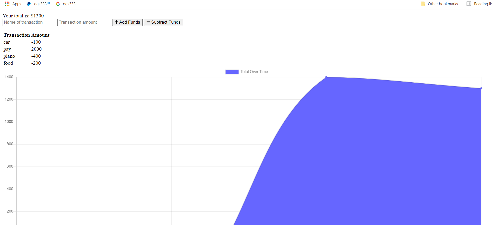

# Budget Tracker

## Jennifer Detmering

## Description-

Tracks account credits and debits on and offline

#### []

## Table of Contents

1. [Installation](#installation)
2. [Usage](#usage)
3. [Technologies Used](#technologies_used)
4. [Credits](#credits)
5. [License](#license)
6. [Features](#features)
7. [Questions and Contributions](#questions_and_contributions)
8. [Tests](#tests)

## Installation-

[Video Demonstration of Application]()

## Usage-

)

## Technologies Used-

npm, CSS, JavaScript, node.js, express, mongoose, webpack, tiny.png, minify

## Credits-

[w3 schools](https://w3schools.com)

## License-

###[![License: MIT]](https://opensource.org/licenses/MIT)

## Features-

Tracks account credits and debits on and offline

## Questions and Contributions-

### GitHub Profile: https://github.com/kodiakshuksan

### Email: kodiakshuksan@yahoo.com

## Tests-

none
